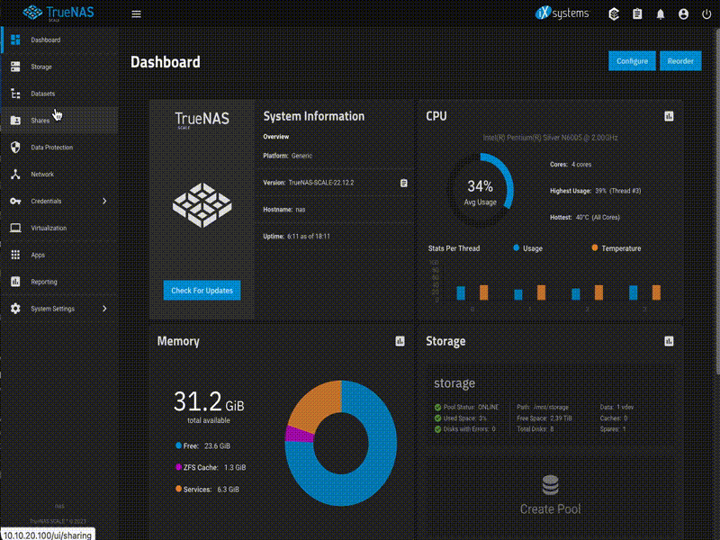

## K8S + TrueNAS Scale using democratic-csi

[democratic-csi](https://github.com/democratic-csi/democratic-csi) based simple guide to use Kubernetes cluster with TrueNAS Scale over API. 

You can use democratic-csi documentation and achieve the same results but the reason I created this 
guide is the fact that democratic-csi docs are covering multiple awkward combinations of various 
technologies and if you just want to have NFS/iSCSI over API then the whole setup guide can be much simpler.

### Prerequisities
You're here cause you want to connect Kubernetes cluster to TrueNAS Scale based NAS right?
So you need:
* K8S cluster - in my case deployed using [kubespray](https://kubespray.io) but it shouldn't really matter what you use to create it.
* NAS based on TrueNAS Scale - in my case it's [ugly-nas](https://github.com/fenio/ugly-nas) 

## Preparations

* Nodes section needs to be run on nodes of your cluster, preferably Debian based
* NAS section needs to be done on your NAS and assumption is that this is TrueNAS Scale based solution
* K8S section needs to be run on whatever machine you're using to manage your cluster

## My setup

* Controlplane - 10.10.20.99
* TrueNAS Scale - 10.10.20.100
* node1 - 10.10.20.101
* node2 - 10.10.20.102
* node3 - 10.10.20.103

### Nodes
All your nodes should be capable of using NFS/iSCSI shares. It means that some extra packages need to be installed 
on them. In my case it's being handled by [dumb-provisioner](https://github.com/fenio/dumb-provisioner) 
which takes care of installing my terminals but in general you just have to run this on every node:

```
# apt install nfs-common open-iscsi multipath-tools scsitools lsscsi
# cat <<EOF > /etc/multipath.conf
defaults {
    user_friendly_names yes
    find_multipaths yes
}
EOF
```

Hash at the beginning of lines means you have to run them as root. So in case you're on Ubuntu just add sudo in front of these commands.
In case of Fedora/RedHat based systems something like that should also work:

```
# dnf install -y lsscsi iscsi-initiator-utils sg3_utils device-mapper-multipath
```

### NAS 

## Let's start with creating API key


Key copied into clipboard needs to be used in YAML files below as apiKey.

Datasets creation for both NFS and iSCSI



Now iSCSI configuration.


And NFS configuration.


Be aware that above setups aren't hardened at all. It's just basic setup created just for tests.
If you want to use it in production environment then you have to tweak it and make it more secure.

### K8S
Let's start with adding repo.

```
helm repo add democratic-csi https://democratic-csi.github.io/charts/
helm repo update
```

Now few words about YAML files used as values for helm charts. 
Since democratic-csi tries to be universal and they cover bunch of different scenarios (which is great BTW!) it means that to prepare file used as values 
for helm chart you have to combine at least two files from their repos. And they explain which files and under which conditions. 
But if you want to use just NFS/iSCSI and just over API then their documentation might be a bit confusing.
Below files prepared by me are based on already combined files but for reference you will also find commands to create skeleton files that you can adapt yourself.
But I want to make it clear. Below you will find simplified version of two files grabbed from democractic-csi repo, merged together, with removed comments and adapted to my needs.
Most of the people will have to do more or less the same but NOT all of them. So be aware that my files might not be something that you can copy and paste to your environment. 

## Files with values.

### nfs.yaml

```
csiDriver:
  name: "nfs"
storageClasses:
- name: nfs
  defaultClass: false
  reclaimPolicy: Delete
  volumeBindingMode: Immediate
  allowVolumeExpansion: true
  parameters:
    fsType: nfs
    detachedVolumesFromSnapshots: "false"
  mountOptions:
  - noatime
  - nfsvers=3
  secrets:
    provisioner-secret:
    controller-publish-secret:
    node-stage-secret:
    node-publish-secret:
    controller-expand-secret:
volumeSnapshotClasses:
- name: nfs
  parameters:
    detachedSnapshots: "true"
driver:
  config:
    driver: freenas-api-nfs
    instance_id:
    httpConnection:
      protocol: http
      host: 10.10.20.100
      port: 80
      apiKey: 1-IvCjJtMLUhEUseYourOwnrK1HKRIFWd1UFK5ay52HogLUrwC2UxjHNQWODCRGhe
      allowInsecure: true
    zfs:
      datasetParentName: storage/k8s/nfs/v
      detachedSnapshotsDatasetParentName: storage/k8s/nfs/s
      datasetEnableQuotas: true
      datasetEnableReservation: false
      datasetPermissionsMode: "0777"
      datasetPermissionsUser: 0
      datasetPermissionsGroup: 0
    nfs:
      shareHost: 10.10.20.100
      shareAlldirs: false
      shareAllowedHosts: []
      shareAllowedNetworks: []
      shareMaprootUser: root
      shareMaprootGroup: root
      shareMapallUser: ""
      shareMapallGroup: ""
```
As already mentioned above is simplified/streamlined version of values file. 
Obviously you have to change at least paths and IP of the server.

Below are the commands to get full file with comments.

```
wget https://raw.githubusercontent.com/democratic-csi/charts/master/stable/democratic-csi/examples/freenas-nfs.yaml -O - | sed '/INLINE/,$d' > nfs.yaml
wget https://raw.githubusercontent.com/democratic-csi/democratic-csi/master/examples/freenas-api-nfs.yaml -O - | sed -e 's/^/    /g' >> nfs.yaml
```

### iscsi.yaml

Make sure to double check your actual portal ID in CLI or over API as TrueNAS WebUI isn't really reliable with regard to that.

Here's how to check it from NAS cli:

```
root@nas[~]# cli
[nas]> sharing iscsi portal query
+----+-----+---------+--------+----------------------+---------------------+
| id | tag | comment | listen | discovery_authmethod | discovery_authgroup |
+----+-----+---------+--------+----------------------+---------------------+
| 8  | 1   | iscsi   | <list> | NONE                 | <null>              |
+----+-----+---------+--------+----------------------+---------------------+
```

Or straight from Linux shell but also using NAS cli:

```
root@nas[~]# cli -c "sharing iscsi portal query"
+----+-----+---------+--------+----------------------+---------------------+
| id | tag | comment | listen | discovery_authmethod | discovery_authgroup |
+----+-----+---------+--------+----------------------+---------------------+
| 8  | 1   | iscsi   | <list> | NONE                 | <null>              |
+----+-----+---------+--------+----------------------+---------------------+
```

```
csiDriver:
  name: "iscsi"
storageClasses:
- name: iscsi
  defaultClass: false
  reclaimPolicy: Delete
  volumeBindingMode: Immediate
  allowVolumeExpansion: true
  parameters:
    fsType: ext4
    detachedVolumesFromSnapshots: "false"
  mountOptions: []
  secrets:
    provisioner-secret:
    controller-publish-secret:
    node-stage-secret:
    node-publish-secret:
    controller-expand-secret:
volumeSnapshotClasses:
- name: iscsi
  parameters:
    detachedSnapshots: "true"
driver:
  config:
    driver: freenas-api-iscsi
    instance_id:
    httpConnection:
      protocol: http
      host: 10.10.20.100
      port: 80
      apiKey: 1-IvCjJtMLUhEUseYourOwnrK1HKRIFWd1UFK5ay52HogLUrwC2UxjHNQWODCRGhe
      allowInsecure: true
    zfs:
      datasetParentName: storage/k8s/iscsi/v
      detachedSnapshotsDatasetParentName: storage/k8s/iscsi/s
      zvolCompression:
      zvolDedup:
      zvolEnableReservation: false
      zvolBlocksize:
    iscsi:
      targetPortal: "10.10.20.100:3260"
      targetPortals: [] 
      interface:
      namePrefix: csi-
      nameSuffix: "-clustera"
      targetGroups:
        - targetGroupPortalGroup: 11
          targetGroupInitiatorGroup: 14
          targetGroupAuthType: None
          targetGroupAuthGroup:
      extentInsecureTpc: true
      extentXenCompat: false
      extentDisablePhysicalBlocksize: true
      extentBlocksize: 512
      extentRpm: "SSD"
      extentAvailThreshold: 0
```

Again above is simplified/streamlined version of values file. Below are the commands to get file with comments.
You have to change portal details so at least its IP, group and initiator group.

```
wget https://raw.githubusercontent.com/democratic-csi/charts/master/stable/democratic-csi/examples/freenas-iscsi.yaml -O - | sed '/INLINE/,$d' > iscsi.yaml
wget https://raw.githubusercontent.com/democratic-csi/democratic-csi/master/examples/freenas-api-iscsi.yaml -O - | sed -e 's/^/    /g' >> iscsi.yaml
```

Once you've got your files you can install democratic-csi like this:


```
helm upgrade --install --create-namespace --values nfs.yaml --namespace storage nfs democratic-csi/democratic-csi
helm upgrade --install --create-namespace --values iscsi.yaml --namespace storage iscsi democratic-csi/democratic-csi
```

If you're experimenting with various settings make sure to uninstall helm release everytime as above command will try to update existing release if it already exists.

State after install (depends on how many nodes you've got in your cluster):

```
# helm ls -n storage
NAME 	NAMESPACE	REVISION	UPDATED                              	STATUS  	CHART                	APP VERSION
iscsi	storage  	1       	2023-06-07 18:54:00.318001 +0200 CEST	deployed	democratic-csi-0.13.7	1.0
nfs  	storage  	1       	2023-06-07 18:55:42.713606 +0200 CEST	deployed	democratic-csi-0.13.7	1.0
# kubectl get all -n storage
NAME                                                   READY   STATUS    RESTARTS   AGE
pod/iscsi-democratic-csi-controller-5bf8f859f6-4xcs4   5/5     Running   0          18h
pod/iscsi-democratic-csi-node-cszgj                    4/4     Running   0          18h
pod/iscsi-democratic-csi-node-f9cpm                    4/4     Running   0          18h
pod/iscsi-democratic-csi-node-r9zgv                    4/4     Running   0          18h
pod/nfs-democratic-csi-controller-658b478c97-v4qb9     5/5     Running   0          18h
pod/nfs-democratic-csi-node-h5h7z                      4/4     Running   0          18h
pod/nfs-democratic-csi-node-ql9lt                      4/4     Running   0          18h
pod/nfs-democratic-csi-node-sfppn                      4/4     Running   0          18h

NAME                                       DESIRED   CURRENT   READY   UP-TO-DATE   AVAILABLE   NODE SELECTOR            AGE
daemonset.apps/iscsi-democratic-csi-node   3         3         3       3            3           kubernetes.io/os=linux   18h
daemonset.apps/nfs-democratic-csi-node     3         3         3       3            3           kubernetes.io/os=linux   18h

NAME                                              READY   UP-TO-DATE   AVAILABLE   AGE
deployment.apps/iscsi-democratic-csi-controller   1/1     1            1           18h
deployment.apps/nfs-democratic-csi-controller     1/1     1            1           18h

NAME                                                         DESIRED   CURRENT   READY   AGE
replicaset.apps/iscsi-democratic-csi-controller-5bf8f859f6   1         1         1       18h
replicaset.apps/nfs-democratic-csi-controller-658b478c97     1         1         1       18h
```

### TEST

Files that we can use to test actual PVC:

pvc-iscsi.yaml
```
kind: PersistentVolumeClaim
apiVersion: v1
metadata:
  name: test-claim-iscsi
  annotations:
    volume.beta.kubernetes.io/storage-class: "iscsi"
spec:
  storageClassName: iscsi
  accessModes:
    - ReadWriteOnce
  resources:
    requests:
      storage: 1Gi
```

pvc-nfs.yaml
```
kind: PersistentVolumeClaim
apiVersion: v1
metadata:
  name: test-claim-nfs
  annotations:
    volume.beta.kubernetes.io/storage-class: "nfs"
spec:
  storageClassName: nfs
  accessModes:
    - ReadWriteOnce
  resources:
    requests:
      storage: 1Gi
```

And actual test:

```
# kubectl apply -f pvc-iscsi.yaml -f pvc-nfs.yaml
persistentvolumeclaim/test-claim-iscsi created
persistentvolumeclaim/test-claim-nfs created
# kubectl get pvc
NAME               STATUS   VOLUME                                     CAPACITY   ACCESS MODES   STORAGECLASS   AGE
test-claim-iscsi   Bound    pvc-461a9ab4-106b-4f62-b06b-746d9c8e8c73   1Gi        RWO            iscsi          11s
test-claim-nfs     Bound    pvc-86623c48-6f32-4d29-8baf-7881c8da1ec2   1Gi        RWO            nfs            11s
```

And cleaning up.

```
# kubectl delete -f pvc-iscsi.yaml -f pvc-nfs.yaml
persistentvolumeclaim "test-claim-iscsi" deleted
persistentvolumeclaim "test-claim-nfs" deleted
```

